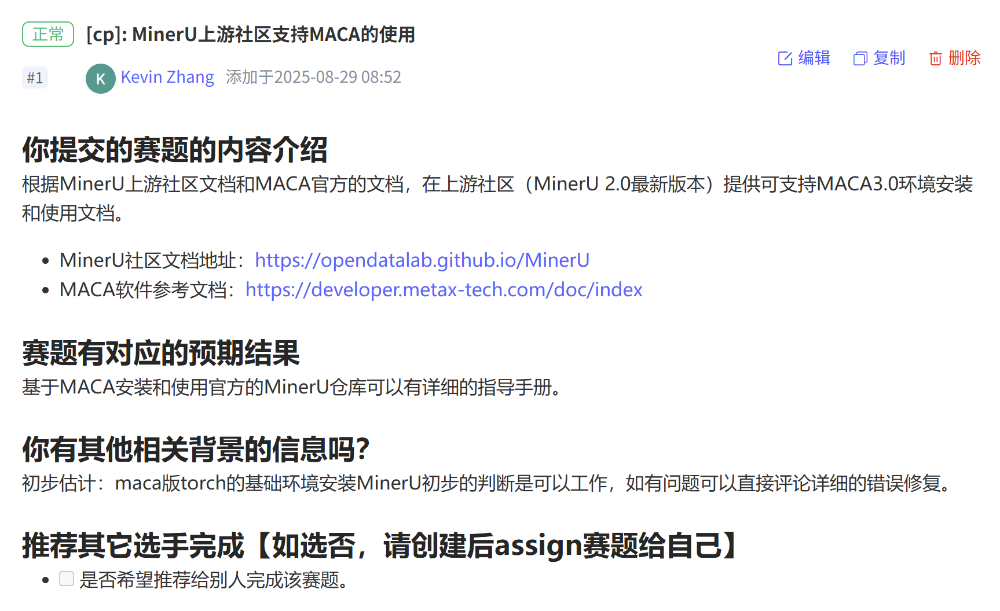

# 子赛题二、GPU 开源生态挑战赛-赛题解读


子赛题二是三个赛题中相对**入门友好、可选范围较广**（如下文实例提交Mineru在C500+MACA3.0环境下的安装和使用文档），聚焦于 国产算力生态适配与开源社区贡献。
该赛题重点考察参赛者在模型迁移、开源生态适配与性能优化 方面的综合能力，旨在推动国产 AI 基础设施的自主可控与生态繁荣。

---

## 1. 参赛提交流程

所有参赛者在提交代码或文档前，**必须先创建对应的 Issue**，
用于描述赛题内容、任务目标与预期结果。

###  1.1 Issue 模板格式（推荐使用）

```
##  赛题名称
简要描述赛题主题或目标。

##  背景介绍
说明赛题来源、相关技术背景或参考文档。

##  预期结果
说明完成赛题后应达到的目标或可验证结果。

##  技术路线建议
可参考的框架、依赖环境、文档地址等。

##  参考链接
- 官方文档：
- 相关仓库：

##  推荐执行者
是否推荐其他选手完成该赛题（如选“否”，请创建后 assign 自己）
```

>  创建完成后系统会自动生成一个编号，如 `#12`。

---

###  1.2 PR 与 Issue 对应规则


**由于目前GitLink没有PR 与Issue对应的功能，所以需选手手动将所提交的PR的Link粘贴至对应的Issue评论区。**

 **推荐做法**：
每个 PR 只关联一个主要 Issue，保持清晰的任务对应关系。

---
###  1.3 如何提交一个PR
详情参考点击 [how_to_contribute_gitlink.md](https://www.gitlink.org.cn/ccf-ai-infra/opengrow/tree/main/how_to_contribute_gitlink.md)

## 2. 赛题流程实例引导

以 Issue [MinerU 上游社区支持 MACA 的使用（#1）](https://www.gitlink.org.cn/ccf-ai-infra/GPUApps/issues/1)为例，引导参赛者可以仿照此流程顺利参与本次 GPU 开源生态挑战赛子赛题二。

###  2.1 提交Issue
内容如下


```
### 你提交的赛题的内容介绍 

根据MinerU上游社区文档和MACA官方的文档，在上游社区（MinerU 2.0最新版本）提供可支持MACA3.0环境安装和使用文档。
- MinerU社区文档地址：https://opendatalab.github.io/MinerU
- MACA软件参考文档：https://developer.metax-tech.com/doc/index

### 赛题有对应的预期结果
基于MACA安装和使用官方的MinerU仓库可以有详细的指导手册。

### 你有其他相关背景的信息吗？
初步估计：maca版torch的基础环境安装MinerU初步的判断是可以工作，如有问题可以直接评论详细的错误修复。

### 推荐其它选手完成【如选否，请创建后assign赛题给自己】

- [ ] 是否希望推荐给别人完成该赛题。
```

###  2.2 提交PR

>根据对应选题提交包含不同内容的PR，具体参照[README.md](https://www.gitlink.org.cn/ccf-ai-infra/GPUApps/tree/main/README.md)


对应 Issue [MinerU 上游社区支持 MACA 的使用（#1）](https://www.gitlink.org.cn/ccf-ai-infra/GPUApps/issues/1)提交的[PR:Mineru在C500+MACA3.0环境下的安装和使用文档](https://github.com/opendatalab/MinerU/pull/3477/files)


>选题和所举实例类似的，选手需保证PR被上游仓库接受。


###  2.3 提交后跟进与反馈

```
若提交的 PR 被上游仓库合并，系统将自动关闭对应的 Issue；
若存在兼容性问题或运行错误，可在原 Issue 下追加评论说明；
评审组将根据上游仓库反馈和代码有效性确定最终得分；
推荐选手在提交后主动跟进讨论区，保持与社区开发者的互动，以加快合并进度。
```


## 3. 赛题选择范围

>赛题二除了下述列出的范围，还有其他挑战方向，具体对应[赛题](https://www.gitlink.org.cn/ccf-ai-infra/GPUApps#readme)

以下列出了本次比赛中认可的上游贡献方向与典型赛题来源。参赛选手可根据自身研究方向与技术特长，选择以下任意任务进行开发与提交。所有任务均需以实际 Issue 创建与 PR 合并记录 为依据，方可计入有效成果。


- 参与MinerU开源社区上游贡献支持MACA软件栈，例如：https://www.gitlink.org.cn/ccf-ai-infra/GPUApps/issues/1

- 参与InfiniCore开源项目的上游贡献支持MACA软件栈，例如项目主仓库：https://github.com/InfiniTensor/InfiniCore, 参考的算子迁移案例见主仓库的其他算子迁移到metax的方式以及：https://github.com/wawahejun/InfiniCore-Intern 里面的迁移案例, 项目文档与概况详见:DEV,待完成迁移到MACA的算子见:TASK

- 参与github.com/MetaX-MACA组织的开源项目上游贡献，例如：https://github.com/MetaX-MACA/vLLM-metax/issues/7


参赛选手可以跳转链接至上游仓库查看issue，选择合适自己的方向。
>注意：比赛提交的issue应按上述实例写清所选的具体题目。


## 总结

子赛题二旨在通过开源协作与技术创新，推动国产 AI 生态在算力适配、模型迁移与性能优化方向的共同发展。参赛者不仅需要具备代码实现与性能验证能力，更应重视开源协作流程的规范性，包括：

- Issue 编写完整清晰：明确任务目标、背景与预期结果，方便评审与上游开发者理解；

- PR 对应关系规范：确保每个 PR 仅关联一个主要 Issue；

- 材料提交完整（按需提交）：提交内容应包含代码、部署脚本、环境配置、测试用例与文档说明；

- 积极跟进反馈：在 PR 合并或讨论过程中，保持与上游社区的沟通，及时响应修改建议。

本赛题为参赛者提供了广阔的探索空间和真实的上游实践环境。无论你选择模型迁移、论文复现，还是生态适配与优化，都将为国产算力平台的繁荣贡献重要力量。

欢迎大家积极参与，共同推动 国产 AI 基础设施与开源生态 的持续发展，为构建开放、自主、可持续的 AI 技术体系贡献力量。